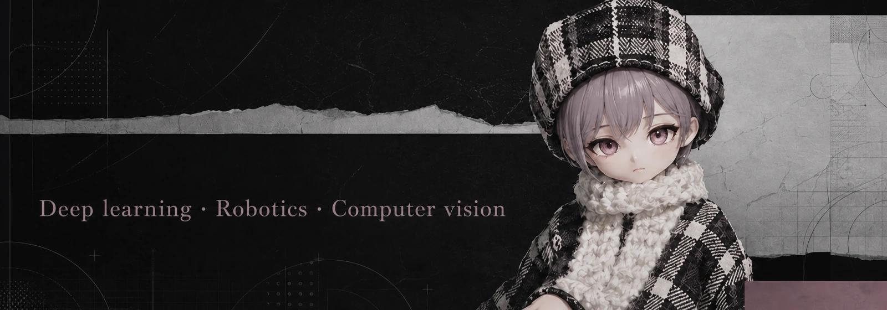
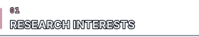
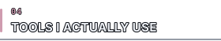
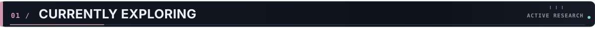
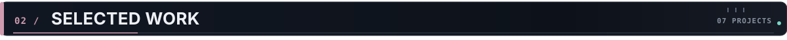
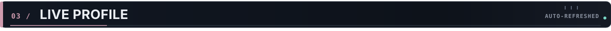
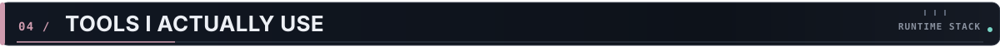

  

  
  
  
  

<h2 id="currently-exploring"></h2>

  

<strong>Research areas as text</strong>

1. **Embodied Intelligence** — Agents that perceive, reason, and act in the physical world.
2. **Vision-Language-Action** — Connecting visual understanding, language-conditioned goals, and control.
3. **Robot Learning** — Imitation learning, reinforcement learning, datasets, and sim-to-real systems.
4. **Multimodal Agents** — Memory, planning, retrieval, and reusable skill representations.

<h2 id="selected-work--07"></h2>

  
  

<table width="100%">
  <tr>
    <td width="50%" valign="top">
       
      
      
    </td>
    <td width="50%" valign="top">
       
      
      
    </td>
  </tr>
  <tr>
    <td width="50%" valign="top">
       
      
    </td>
    <td width="50%" valign="top">
       
      
      
    </td>
  </tr>
  <tr>
    <td width="50%" valign="top">
       
      
    </td>
    <td width="50%" valign="top">
       
      
    </td>
  </tr>
</table>

<h2 id="live-profile"></h2>

<!-- LIVE_PROFILE:START -->

  

<strong>Accessible live data</strong>

<table><tr><td><strong>Status</strong></td><td><strong>Repositories</strong></td><td><strong>Stars</strong></td><td><strong>Followers</strong></td></tr>
<tr><td>EXPERIMENTING</td><td>22</td><td>43</td><td>3</td></tr></table>
<table><tr><td width="52%" valign="top"><strong>PROJECT PULSE</strong>

<code>01</code> <a href="https://github.com/satoshinji2992/quickly_access_to_deeplearning"><strong>Deep Learning Tutorial</strong></a> tutorial · ★ 26 · updated 23 Aug 2026

<code>02</code> <a href="https://github.com/satoshinji2992/SeiyuuMatch"><strong>SeiyuuMatch</strong></a> production website · ★ 5 · updated 04 Jun 2026

<code>03</code> <a href="https://github.com/satoshinji2992/lerobot"><strong>LeRobot</strong></a> upstream contribution · ★ 0 · updated 20 Jan 2026

</td><td width="48%" valign="top"><strong>RECENT ACTIVITY</strong>

● <strong>Deep Learning Tutorial</strong> 23 Aug 2026 · pushed 1 commit

● <strong>Deep Learning Tutorial</strong> 19 Aug 2026 · closed a pull request

● <strong>Deep Learning Tutorial</strong> 20 Aug 2026 · commented on an issue

● <strong>Deep Learning Tutorial</strong> 20 Aug 2026 · pushed 1 commit

</td></tr></table>
Auto-refreshed 2026-09-02 07:08 UTC · live GitHub API

<!-- LIVE_PROFILE:END -->

<h2 id="tools-i-actually-use"></h2>

  

