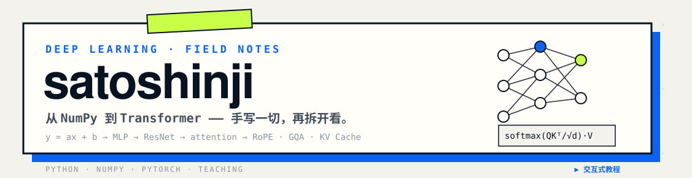

<div align="center">



**手写 NumPy 深度学习库 · 用实现倒推理解**

</div>

---

```bash
$ whoami
sato_shinji —— 在写一套以实现为主的中文深度学习教程

$ cat current/mission
把每个组件从零写一遍：forward、backward、缓存、状态，
再用可视化和交互演示拆开给你看。

$ ls stack/
python/   numpy/   pytorch/   hugo/   vanilla-js/
```

---

### 🔭 主打项目

<div align="center">

[](https://github.com/satoshinji2992/quickly_access_to_deeplearning)

[](https://satoshinji2992.github.io/quickly_access_to_deeplearning/)
[](https://github.com/satoshinji2992/quickly_access_to_deeplearning/stargazers)
[](https://github.com/satoshinji2992/quickly_access_to_deeplearning/actions)

**NumPy 手写 MLP / ResNet / decoder-only Transformer（RoPE · GQA · KV Cache）**
**17 个可交互演示组件，全部内嵌在教程正文里**

</div>

---

### 📊 数据

<div align="center">


</div>

---

<div align="center">

*i* = 0 … *d*/2,　*θᵢ* = 10000^(−2*i*/*d*)


</div>
