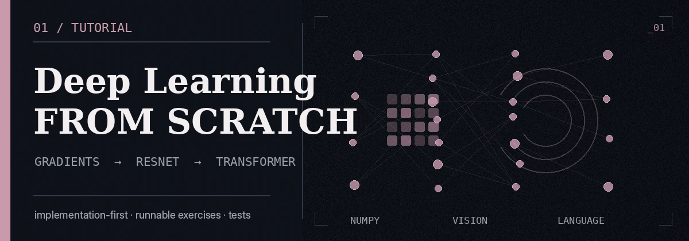
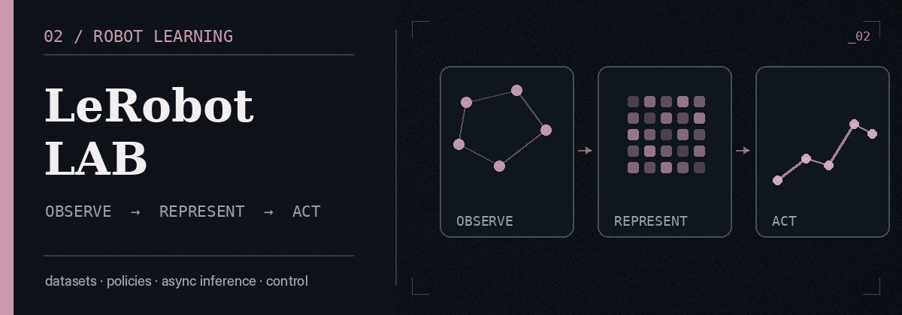
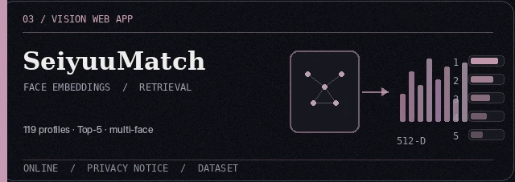

  

  <strong>Deep learning · Embodied intelligence · Robotics</strong> 
  Learning systems by rebuilding them, testing them, and turning them into things that work.

  <a href="#selected-work--03">Selected work</a>
  ·
  <a href="#currently-exploring">Research interests</a>
  ·
  <a href="#live-profile">Live activity</a>

 

## ABOUT

Computer Science undergraduate at **Beijing University of Posts and Telecommunications**, working around **deep learning, embodied intelligence, and robotics**.

I prefer understanding systems from the inside out: implementing neural networks from NumPy, tracing modern Transformer components, experimenting with robot-learning stacks, and turning narrowly motivated ideas into complete public projects. I am currently exploring multimodal agents, vision-language-action systems, robot learning, and reusable representations of skills.

> **I tend to learn things by rebuilding them.**

<strong>中文介绍</strong>

 

北京邮电大学计算机专业本科生，主要关注深度学习、具身智能与机器人。我习惯通过亲手重建系统来理解系统，从 NumPy 神经网络、ResNet 和 Transformer，到机器人学习、多模态智能体与可复用技能表示；也会把一些动机很具体的想法做成真正可运行、可公开使用的项目。

 

## SELECTED WORK // 03

<table>
  <tr>
    <td colspan="2">
      
      <h3>01 / Deep Learning from Scratch</h3>
      

        An implementation-first deep-learning tutorial that moves from gradients and a small NumPy neural-network library
        to CIFAR-100 ResNet and a decoder-only Transformer with RoPE, GQA, and KV cache.
        It includes runnable exercises, reference implementations, interactive explanations, and automated checks for gradients, shapes, data isolation, and checkpoint round trips.
      

      
<code>NumPy</code> <code>PyTorch</code> <code>ResNet</code> <code>Transformer</code> <code>Testing</code>

      

        <a href="https://github.com/satoshinji2992/quickly_access_to_deeplearning"><strong>Repository →</strong></a>
        &nbsp;·&nbsp;
        <a href="https://satoshinji2992.github.io/quickly_access_to_deeplearning/"><strong>Interactive tutorial ↗</strong></a>
      

    </td>
  </tr>
  <tr>
    <td width="50%" valign="top">
      
      <h3>02 / LeRobot Lab</h3>
      

        A personal fork and experiment workspace for studying modern robot-learning pipelines across datasets, policies, simulation, and real-world control.
        My upstream contribution to LeRobot added explicit client-device handling to asynchronous inference, together with documentation, unit tests, and an end-to-end CUDA-to-CPU test.
      

      
<code>LeRobot</code> <code>VLA</code> <code>Imitation Learning</code> <code>PyTorch</code>

      

        <a href="https://github.com/satoshinji2992/lerobot"><strong>Workspace →</strong></a>
        &nbsp;·&nbsp;
        <a href="https://github.com/huggingface/lerobot/pull/2792"><strong>Merged upstream PR #2792 ↗</strong></a>
      

    </td>
    <td width="50%" valign="top">
      
      <h3>03 / SeiyuuMatch ♡</h3>
      

        A deployed face-similarity web application that matches an uploaded photo against a curated dataset of 119 Japanese voice actresses.
        It supports multiple faces, Top-5 candidates, Bang Dream! / Love Live! filters, dataset contributions, and an optional face-swap pipeline with CodeFormer restoration.
      

      
<code>InsightFace</code> <code>ONNX Runtime</code> <code>Computer Vision</code> <code>Web App</code>

      

        <a href="https://seiyuumatch.org"><strong>Live demo ↗</strong></a>
        &nbsp;·&nbsp;
        <a href="https://github.com/satoshinji2992/SeiyuuMatch"><strong>Source →</strong></a>
      

    </td>
  </tr>
</table>

 

## LIVE PROFILE

  

The panel above is rendered inside this repository. A scheduled GitHub Action refreshes public repository counts, project update times, and recent public activity without depending on a third-party profile-stat service.

 

## CURRENTLY EXPLORING

<table>
  <tr>
    <td width="20%"><code>01</code></td>
    <td width="30%"><strong>Embodied Intelligence</strong></td>
    <td>Agents that perceive, reason, and act in the physical world.</td>
  </tr>
  <tr>
    <td><code>02</code></td>
    <td><strong>Vision-Language-Action</strong></td>
    <td>Connecting visual understanding, language-conditioned goals, and control.</td>
  </tr>
  <tr>
    <td><code>03</code></td>
    <td><strong>Robot Learning</strong></td>
    <td>Imitation learning, reinforcement learning, datasets, and sim-to-real systems.</td>
  </tr>
  <tr>
    <td><code>04</code></td>
    <td><strong>Multimodal Agents</strong></td>
    <td>Memory, planning, retrieval, and reusable skill representations.</td>
  </tr>
</table>

 

## TOOLS I ACTUALLY USE

<table>
  <tr>
    <td width="33%" valign="top">
      <strong>LEARNING</strong>  
      PyTorch 
      NumPy 
      Transformers
    </td>
    <td width="33%" valign="top">
      <strong>EMBODIED</strong>  
      LeRobot 
      Isaac Lab 
      ROS
    </td>
    <td width="33%" valign="top">
      <strong>SYSTEMS</strong>  
      Python 
      C++ 
      Linux
    </td>
  </tr>
</table>

 

  Research, systems, and the occasional project that exists because the idea was worth testing.

